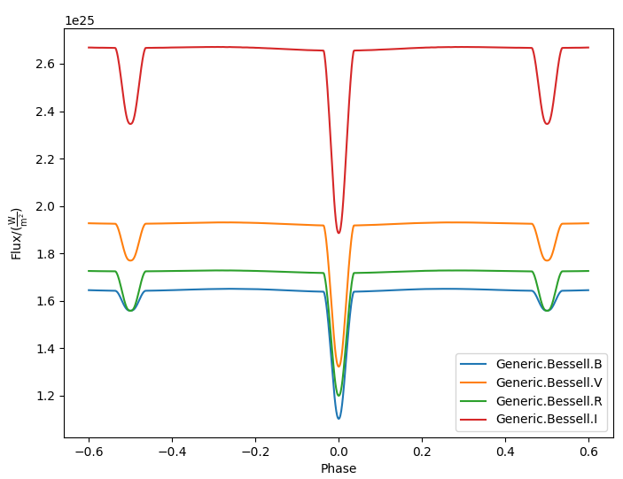

# ELISA

[](https://www.python.org/)
[](https://www.gnu.org/licenses/gpl-3.0.html)
[](https://github.com/mikecokina/elisa/commits/dev)
[](https://pypi.org/project/setuptools/)
[](https://en.wikipedia.org/wiki/Operating_system)


## Publications

[ELISa: A new tool for fast modelling of eclipsing binaries](https://arxiv.org/abs/2106.10116)


## Introduction

**ELISa** is a cross-platform Python package for modeling the light curves of close eclipsing binary systems, including surface features such as spots. Support for pulsations is planned.

Current capabilities include:

- **`BinarySystem`** - modeling detached, semi-detached, and over-contact binary systems
- **`SingleSystem`** - modeling single-star light curves with spot support (pulsations planned)
- **`Observer`** - generating synthetic observables such as light curves (with more observables planned)
- **`Spots`** - defining stellar spots by longitude, latitude, radius, and temperature factor
- **`Pulsations`** - low-amplitude pulsations modeled using spherical harmonics
- **`Fitting methods`** - fitting light curves and radial velocity curves using:
  - non-linear least squares
  - Markov Chain Monte Carlo (MCMC)
- **`Radial velocity modeling`** - including the Rossiter-McLaughlin effect and RV variations due to spots (and pulsations where applicable)

ELISa is under active development. Work in progress includes:

- extending **LC** and **RV** fitting with additional methods and utilities, including automated classification of eclipsing binaries using neural networks to support solving the inverse problem

Planned features include:

- synthetic spectral line modeling


## Installation

ELISa requires **Python 3.10 or newer**.

It is strongly recommended to install ELISa inside a virtual environment.

### 1. Create and activate a virtual environment

```bash
python -m venv .venv
source .venv/bin/activate        # Linux / macOS
# .venv\Scripts\activate         # Windows
```

Upgrade pip:

```bash
python -m pip install --upgrade pip
```

---

### 2. Install ELISa

Install the latest stable release from PyPI:

```bash
pip install elisa
```

Install the latest development version from GitHub:

```bash
pip install git+https://github.com/mikecokina/elisa.git@dev
```

---

### Optional: Jupyter Notebooks

To run example notebooks:

```bash
pip install jupyterlab ipykernel
```

Then launch:

```bash
jupyter lab
```


## Configuration

### Minimal Configuration

Starting from version **0.6**, ELISa includes a built-in **Settings Manager** and **Download Manager** to simplify first-time setup.

When ELISa is executed for the first time and no configuration file is detected, a setup wizard will guide you through the basic configuration process. A default configuration file will be created at:

```
~/.elisa/config.ini
```

The wizard will prompt you to:

- Select directories for storing atmosphere models and limb darkening tables  
- Choose a default atmosphere atlas  
- Optionally download required data files automatically  

This allows most users to get started without any manual configuration.

---

### Manual Configuration

ELISa requires atmosphere models and limb darkening tables before it can run.

You can download them from:

- Atmosphere models:  
  https://github.com/mikecokina/elisa/tree/dev/atmosphere  
- Limb darkening tables:  
  https://github.com/mikecokina/elisa/tree/dev/limbdarkening  

---

### Default Data Locations

By default, ELISa searches for data files in:

- Atmospheres: `$HOME/.elisa/atmosphere/`
- Limb darkening tables: `$HOME/.elisa/limbdarkening/`

If the files are stored in these directories, no additional configuration is required.

---

### Custom Data Locations

You may store atmosphere models and limb darkening tables in any directory of your choice.

For example:

- Atmospheres: `/home/user/castelli_kurucz/ck04`
- Limb darkening: `/home/user/ld/`

Create a configuration file, for example:

```
/home/user/.elisa/elisa_config.ini
```

With minimal content such as:

```ini
[support]
ld_tables = /home/user/ld
castelli_kurucz_04_atm_tables = /home/user/castelli_kurucz/ck04
atlas = ck04
```

A complete configuration reference is available here:

https://github.com/mikecokina/elisa/blob/master/src/elisa/conf/elisa_conf_docs.ini

---

### Important Note on Data Format

Atmosphere models and limb darkening tables are stored in standard `.csv` format.  
However, their native format is not directly compatible with ELISa.  
The provided datasets have been converted to a format required by ELISa.

---

### Specifying a Custom Configuration File

If you are not using the default configuration path, set the environment variable `ELISA_CONFIG` to point to your configuration file.

On Linux or macOS:

```bash
export ELISA_CONFIG=/home/user/.elisa/elisa_config.ini
```

You can place this command in your shell configuration file (for example, `.bashrc` or `.zshrc`) to make it persistent.

On Windows (PowerShell):

```powershell
setx ELISA_CONFIG "C:\Users\user\.elisa\elisa_config.ini"
```

Alternatively, you may use the default `config.ini` file located in:

```
src/elisa/conf/
```

without defining any environment variable.

---

Once configured, ELISa is ready to use.


## Physics

For a detailed description of the physical assumptions and numerical methods used in ELISa,  
please refer to the **ELISa Handbook**:

https://github.com/mikecokina/elisa/blob/dev/ELISa_handbook.pdf

The handbook explains the modeling of single stars and binary systems, including surface discretization, 
radiative treatment, orbital dynamics, and observable synthesis.

---

## Available Passbands

ELISa can currently model light curves in the following photometric filters:

```
bolometric
Generic.Bessell.U
Generic.Bessell.B
Generic.Bessell.V
Generic.Bessell.R
Generic.Bessell.I
SLOAN.SDSS.u
SLOAN.SDSS.g
SLOAN.SDSS.r
SLOAN.SDSS.i
SLOAN.SDSS.z
Generic.Stromgren.u
Generic.Stromgren.v
Generic.Stromgren.b
Generic.Stromgren.y
Kepler
Gaia.2010.G
Gaia.2010.BP
Gaia.2010.RP
TESS
```

Support for additional passbands may be added in future releases.

---

## Multiprocessing

ELISa supports parallel computation of light curves to improve performance on multi-core systems.

During multiprocessing, the requested light curve points are divided into smaller batches, 
and each batch is evaluated on a separate CPU core.

### Important Considerations

- Parallelization introduces computational overhead.
- For simple systems (e.g., circular, synchronous, spot-free binaries), multiprocessing may not provide a speed benefit.
- Performance gains depend strongly on system complexity and hardware.

In general, multiprocessing is most effective for:

- Eccentric orbits  
- Systems with surface spots  
- Systems requiring expensive radiative computations  

Careful benchmarking on your target system is recommended to determine whether multiprocessing 
improves performance for your specific use case.


## Examples

### Building a Simple Binary System Model (Minimal Working Example)

ELISa allows fast construction of binary system models using parameters provided as a Python dictionary (or JSON).  

Model parameters are grouped into three sections:

- `system`
- `primary`
- `secondary`

You can define the system either by:

- specifying component masses using the `mass` parameter, **or**
- providing `mass_ratio` together with `semi_major_axis`

Example:

```python
from elisa import BinarySystem

community_params = {
    "system": {
        "inclination": 86.0,
        "period": 10.1,
        "argument_of_periastron": 90.0,
        "gamma": 0.0,
        "eccentricity": 0.0,
        "primary_minimum_time": 0.0,
        "phase_shift": 0.0,
        "semi_major_axis": 10.5,  # default unit: solar radii
        "mass_ratio": 0.5
    },
    "primary": {
        "surface_potential": 7.1,
        "synchronicity": 1.0,
        "t_eff": "6500.0 K",  # values may use astropy-compatible unit strings
        "gravity_darkening": 1.0,
        "albedo": 1.0,
        "metallicity": 0.0
    },
    "secondary": {
        "surface_potential": 7.1,
        "synchronicity": 1.0,
        "t_eff": 5000.0,
        "gravity_darkening": 1.0,
        "albedo": 1.0,
        "metallicity": 0.0
    }
}

community_binary = BinarySystem.from_json(community_params)
```

See Tutorials 1-4 for a detailed explanation of system construction and parameter choices.

---

### Calculating a Light Curve

Once the binary system is defined, you can generate synthetic observations using the `Observer` class:

```python
from elisa import Observer

o = Observer(
    passband=[
        "Generic.Bessell.B",
        "Generic.Bessell.V",
        "Generic.Bessell.R",
        "Generic.Bessell.I"
    ],
    system=community_binary
)

# Generate a light curve with 1200 phase points
phases, fluxes = o.observe.lc(
    from_phase=-0.6,
    to_phase=0.6,
    phase_step=0.001,
    # normalize=True  # Uncomment to normalize flux to unity
)
```

The returned arrays:

- `phases` - orbital phase values  
- `fluxes` - computed fluxes for each selected passband  

This provides a complete minimal workflow: define the system, instantiate the observer, and generate synthetic light curves.


## Visualization

ELISa includes a built-in visualization interface for convenient inspection of model results.

For example, a light curve computed with an `Observer` instance `o` can be displayed using:

```python
o.plot.lc()
```



The plotting interface supports visualization of multi-passband light curves and other model outputs.

---

## Desktop UI

ELISa ships with an interactive desktop application built on [Gradio](https://www.gradio.app/). It covers the full
workflow - modeling, fitting, and visualization - without writing any code.

**Launch the UI:**

```bash
python -m elisa.ui
```

The app opens in your browser at `http://localhost:7860` and provides five tabs:

- **Light Curve Modeling** - generate synthetic light curves
- **Radial Velocity Modeling** - generate synthetic RV curves (kinematic or radiometric method)
- **Light Curve Fitting** - fit observed LC data using The Least Squares or MCMC
- **Radial Velocity Fitting** - fit observed RV data using The Least Squares or MCMC
- **System Visualization** - render surface, mesh, orbit, and equipotential plots

For full usage instructions, parameter descriptions, and worked examples see
**[UI_GUIDE.md](./UI_GUIDE.md)**.

---

## Solving the Inverse Problem

ELISa provides built-in functionality for inferring binary system parameters from observational data. Similar to the 
binary system construction demonstrated above, the fitting parameters are supplied as a dictionary (or JSON object) in 
the following format:

```python
fit_params = {
    "system": {
        "mass_ratio": {...},
        "eccentricity": {...},
        ...
    },
    "primary": {
        "surface_potential": {...},
        ...
    },
    "secondary": {
        "surface_potential": {...},
        ...
    },
    "nuisance": {  # used only for MCMC
        "ln_f": {...}
    }
}
```

Each model parameter (e.g., `mass_ratio`) is defined as a dictionary that specifies its role and behavior during the 
fitting procedure. ELISa recognizes three main types of model parameters.

### Parameter Types

ELISa supports three types of parameters:

#### 1. Fixed

The parameter remains constant during optimization.

```python
"t_eff": {
    "value": 5774,
    "fixed": True,
    "unit": "K"
}
```

---

#### 2. Variable

The parameter is optimized within a specified interval.

```python
"surface_potential": {
    "value": 5.2,     # initial value
    "fixed": False,
    "min": 4.0,
    "max": 7.0,
    "unit": None      # optional
}
```

For MCMC fitting, parameters may also use Gaussian priors:

```python
"t_eff": {
    "value": 6300,     # mean
    "sigma": 400,      # standard deviation
    "fixed": False,
    "min": 3500,       # The normal distribution can be optionally clipped to prevent the sampler from exploring invalid regions of parameter space.
    "max": 50000,      # the normal distribution can be optionally clipped to prevent the sampler from exploring invalid regions of parameter space.
    "unit": "K"
}
```

---

#### 3. Constrained

The parameter is computed from other parameters during optimization.

```python
"semi_major_axis": {
    "value": 16.515,
    "constraint": "16.515 / sin(radians(system@inclination))"
}
```

This feature is particularly useful when incorporating parameters such as `a sin(i)`, derived from radial velocity fitting, 
into light curve fitting in order to constrain the system’s `semi-major` axis through its inclination.

---

## Running a Fit

Once the model parameters are defined, the optimization task can be initialized using one of the available fitting methods. 
The following example demonstrates how to initialize a task for light curve fitting:

```python
from elisa.analytics import LCData, LCBinaryAnalyticsTask

# phased and normalized (to 1) light curve observed by the Kepler
kepler_data = LCData.load_from_file(
    filename="path/to/your/data.dat",
    x_unit=None,
    y_unit=None
)

task = LCBinaryAnalyticsTask(
    data={"Kepler": kepler_data},
    method="least_squares",
    expected_morphology="detached"
)
```


Observational data are provided in a custom Dataset format, defined separately for each filter. The optimization task 
currently supports the least_squares and mcmc methods. The `least-squares` method is intended for rapid determination 
of a local minimum near the initial parameter values. In contrast, the `MCMC` method is primarily used to estimate 
confidence intervals for model parameters around the solution obtained from the `least-squares` fit.

For light curve fitting, the optimizer requires the `expected_morphology` of the system, with the available options 
being `detached` and `over-contact`.

**Supported optimization methods:**

- `"least_squares"` - fast local optimization  
- `"mcmc"` - parameter estimation and confidence interval evaluation  

**The `expected_morphology` argument currently supports**:

- `"detached"`
- `"over-contact"`

---

## Executing the Fit

The fitting procedure can then be initiated with the following command:

```python
task.fit(x0=fit_params, **kwargs)
task.save_result("result.json")
```

Results can be summarized with:

```python
task.fit_summary()
```

The summary table includes:

- System parameters
- Component parameters
- Derived quantities
- Parameter status (Fixed, Variable, Derived, Constrained)
- Uncertainties (for MCMC)

**Example:**

```text
BINARY SYSTEM
Parameter                                          value            -1 sigma            +1 sigma                unit    status
------------------------------------------------------------------------------------------------------------------------------
Mass ratio (q=M_2/M_1):                             1.08                   -                   -                None    Fixed
Semi major axis (a):                               11.53                   -                   -              solRad    11.2 / sin(radians(system@inclination))
Inclination (i):                                   76.26                   -                   -                 deg    Variable
Eccentricity (e):                                   0.03                   -                   -                None    Variable
Argument of periastron (omega):                   197.93                   -                   -                 deg    Variable
Orbital period (P):                              2.47028                   -                   -                   d    Fixed
Additional light (l_3):                            0.014                   -                   -                None    Variable
Phase shift:                                   7.378e-05                   -                   -                None    Variable
------------------------------------------------------------------------------------------------------------------------------
PRIMARY COMPONENT
Parameter                                          value            -1 sigma            +1 sigma                unit    status
------------------------------------------------------------------------------------------------------------------------------
Mass (M_1):                                         1.62                   -                   -             solMass    Derived
Surface potential (Omega_1):                      5.8397                   -                   -                None    Variable
Critical potential at L_1:                        4.0162                   -                   -                   -    Derived
Synchronicity (F_1):                               1.067                   -                   -                None    (1 + system@eccentricity)**2 / (1 - system@eccentricity**2)**(3.0/2.0)
Polar gravity (log g):                             3.888                   -                   -            log(cgs)    Derived
Equivalent radius (R_equiv):                     0.21168                   -                   -                 SMA    Derived

Periastron radii
Polar radius:                                    0.20899                   -                   -                 SMA    Derived
Backward radius:                                 0.21457                   -                   -                 SMA    Derived
Side radius:                                      0.2113                   -                   -                 SMA    Derived
Forward radius:                                  0.21583                   -                   -                 SMA    Derived

Atmospheric parameters
Effective temperature (T_eff1):                   7022.0                   -                   -                   K    Fixed
Bolometric luminosity (L_bol):                     13.05                   -                   -               L_Sol    Derived
Gravity darkening factor (G_1):                      1.0                   -                   -                None    Fixed
Albedo (A_1):                                        1.0                   -                   -                None    Fixed
Metallicity (log10(X_Fe/X_H)):                       0.0                   -                   -                None    Fixed
------------------------------------------------------------------------------------------------------------------------------
SECONDARY COMPONENT
Parameter                                          value            -1 sigma            +1 sigma                unit    status
------------------------------------------------------------------------------------------------------------------------------
Mass (M_2):                                         1.75                   -                   -             solMass    Derived
Surface potential (Omega_2):                      5.7303                   -                   -                None    Variable
Critical potential at L_1:                         4.018                   -                   -                   -    Derived
Synchronicity (F_2):                               1.067                   -                   -                None    (1 + system@eccentricity)**2 / (1 - system@eccentricity**2)**(3.0/2.0)
Polar gravity (log g):                             3.857                   -                   -            log(cgs)    Derived
Equivalent radius (R_equiv):                     0.22835                   -                   -                 SMA    Derived

Periastron radii
Polar radius:                                    0.22512                   -                   -                 SMA    Derived
Backward radius:                                 0.23181                   -                   -                 SMA    Derived
Side radius:                                     0.22802                   -                   -                 SMA    Derived
Forward radius:                                  0.23343                   -                   -                 SMA    Derived

Atmospheric parameters
Effective temperature (T_eff2):                   6793.0                   -                   -                   K    Variable
Bolometric luminosity (L_bol):                      13.3                   -                   -               L_Sol    Derived
Gravity darkening factor (G_2):                      1.0                   -                   -                None    Fixed
Albedo (A_2):                                        1.0                   -                   -                None    Fixed
Metallicity (log10(X_Fe/X_H)):                       0.0                   -                   -                None    Fixed
------------------------------------------------------------------------------------------------------------------------------
```


---

## Additional Resources

Detailed step-by-step fitting guides are available in:

- **[UI_GUIDE.md](./UI_GUIDE.md)** - complete user guide for the desktop application
- Notebook 10 - Working with ELISa datasets
- Notebook 11 - Light curve fitting
- Notebook 12 - Radial velocity fitting
