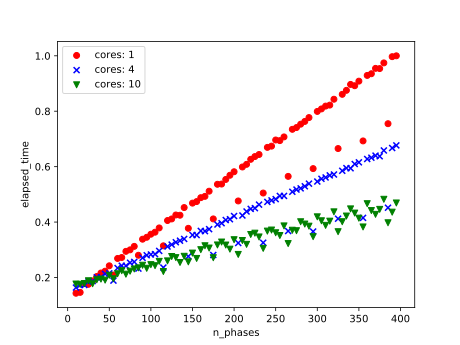
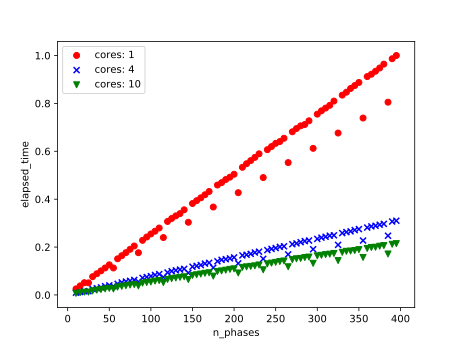
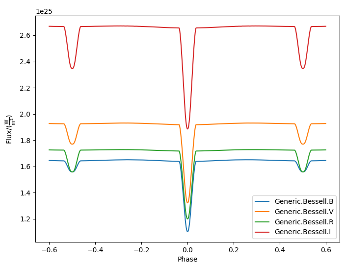

|GitHub version|  |Licence GPLv3| |Python version| |OS|

.. |GitHub version| image:: https://img.shields.io/badge/version-0.6.0.rc1-yellow.svg
   :target: https://github.com/mikecokina/elisa/commits/release/0.6.0.rc1

.. |Python version| image:: https://img.shields.io/badge/python-3.6|3.7|3.8|3.9|3.10|3.11|3.12-orange.svg
   :target: https://www.python.org/

.. |Licence GPLv3| image:: https://img.shields.io/badge/license-GNU/GPLv3-blue.svg
   :target: https://www.gnu.org/licenses/gpl-3.0.html

.. |OS| image:: https://img.shields.io/badge/os-Linux|Windows-magenta.svg
   :target: https://en.wikipedia.org/wiki/Operating_system

.. _example_scripts: https://github.com/mikecokina/elisa/tree/master/scripts/analytics

Eclipsing binaries Learning & Interactive System
================================================

Publications
------------

`ELISa: A new tool for fast modelling of eclipsing binaries <https://arxiv.org/abs/2106.10116>`_

ELISa
-----

Latest version
~~~~~~~~~~~~~~

ELISa has been updated to work with the latest Python versions up to v3.12. However, the latest package
released on PyPI is only compatible with Python versions up to v3.8. If you want to install ELISa with a
newer Python version, please install it from GitHub:

    pip install git+https://github.com/mikecokina/elisa.git@release/0.6.0.rc1

In case of any installation issues, please do not hesitate to create an issue on GitHub.

**ELISa** is a cross-platform python package dedicated to light curves modelling of close eclipsing binaries including
surface features such as spots (and pulsations which will be added soon). Current capabilities include:

    - ``BinarySystem:`` class for modelling surfaces of detached, semi-detached and over-contact binaries
    - ``SingleSystem:`` class for modelling surfaces of single star light curves with full implementation of spots and
      pulsations
    - ``Observer:`` class for generating light curves (and in future other observables)
    - ``Spots:`` class for generating stellar spot with given longitude, latitude, radius and temperature factor
    - ``Pulsations:`` class for modelling low amplitude pulsations based on spherical harmonics
    - ``Fitting methods`` provide capabilities to fit radial velocities curves and light curves via implementaion of
      ``non-linear least squares`` method and also via ``Markov Chain Monte Carlo`` method.
    - radial velocity curve modelling in Observer class including ``Rossiter-McLaughlin`` effect, variation due to
      spots and pulsations

**ELISa** is currently still under development. Development of the following features is in progress:

    - extension of ``LC`` and ``RV`` fitting methods using various additional methods and features such as
      classification of eclipsing binaries via ``neural-networks`` aimed towards automatisation of the inverse problem,

We also plan to implement following features:

    - addition of synthetic spectral line modelling

Requirements
------------

**ELISa** is a python package which requires ``python v3.6+`` and has following dependencies::

    astropy>=4.0.1,<=5.3.4
    corner>=2.2.1
    emcee>=3.0.1,<=3.1.6
    jsonschema>=3.2.0
    matplotlib>=3.3.2,<=3.7.5
    numpy>=1.16.2,<=1.26.4
    pandas>=0.24.0,<=1.5.3
    packaging<=24.2
    pytest>=3.2.3,<=8.3.4
    python-dateutil>=2.6.1,<=2.8.1
    scipy>=1.0.0,<=1.10.1
    tqdm>4.43.0
    parameterized>=0.7.4
    numba>=0.51.2
    requests>=2.26.0

and potentially also **python-tk** package or equivalent for matplotlib package to display the figures correctly.

:note: although python distribution and package versions are specified precisely, that does not mean that the package
       will not work with higher versions, only that the ELISa was not tested using newer versions. However, we highly
       recommend sticking with the python distribution and package versions listed above.

Installing process
------------------

In the case of ``ELISa``, the easiest and safest way to install is to create a python virtual
environment and install all requirements into it. Below is a simple guide, how to do it. Details of installation differ
in dependence on the selected operating system.

Ubuntu [or similar]
~~~~~~~~~~~~~~~~~~~

First, you have to install Python 3.6 or higher. In the latest stable version ``Ubuntu 18.04`` there is already preinstalled
python `3.6.x`. In older versions, you will have to add the repository and install it manually. Several guides
on the internet will help you with installation, e.g. Python_3.6_

.. _Python_3.6: http://ubuntuhandbook.org/index.php/2017/07/install-python-3-6-1-in-ubuntu-16-04-lts/

Install ``pip3`` python package manager if is not already installed on your system, usually by execution of the
command::

    apt install -y python3-pip

or you can also use `raw` python script which provides installation via ``python``::

    curl https://bootstrap.pypa.io/get-pip.py | python3.6

Install virtual environment by command::

    pip3 install virtualenv

To create a virtual environment, create a directory where the python virtual environment will be stored,
e.g. ``/<any>/<path>/elisa/venv``
and run the following command::

    virtualenv /<any>/<path>/elisa/venv --python=python3.6

After few moments your virtual environment is created and ready for use. In the terminal window, activate virtual
environment::

    . /<any>/<path>/elisa/venv/bin/activate

When the virtual environment is activated, install the ``elisa`` package in the latest stable version::

    pip install elisa

or you can choose to install the current development version::

    pip install git+https://github.com/mikecokina/elisa.git@dev

You will probably also need to install::

    apt install -y python3-tk

If you would like to have a look at the jupyter notebooks covering the basic usage of this package, you should install
jupyterlab inside the previously created virtual environment::

    pip3 install jupyterlab

followed by installation of ipython kernel::

    python3 -m pip install ipykernel

Now you should be able to launch jupyter notebooks and run the tutorials stored in <elisa_dir>/jupyter_tutorials/.

Windows
~~~~~~~

To install python in windows, download the ``python 3.6.x`` installation package from the official Python website.
The installation package will create all necessary dependencies except the virtual environment package.
Install virtual environment by execution of following command in the command line::

    pip3 install virtualenv

Make sure a correct version of python and pip is used. When done, create a directory where the virtual environment will be
stored and run::

    virtualenv /<any>/<path>/elisa --python<path>/<to>/python3.6/python.exe

It is common to specify the full path to the ``python.exe`` file under Windows, otherwise, It might not work.

Now, when the virtual environment is prepared, run::

    . /<any>/<path>/elisa/Scripts/activate

And finally install ``ELISa``::

    pip install elisa

How to build API docs
=====================

Read this readme_ file to see detailed instruction how to generate up to date documentation.

.. _readme: https://github.com/mikecokina/elisa/blob/master/docs/README.rst

Minimal configuration
---------------------

From version **0.6**, ELISa provides a feature to make configuration easier for first time running users. We implemented
`Settings Manager` and `Download Manager`. When any ELISa script is first time executed and there is missing configuration
file a wizzard will walk you through basic configuration (default configuration will be stored in path `~/.elisa/config.ini` file).
It asks you to supply a directories to store atmospheres and limb darkening files and default atmosphere atlas. It also gives
you a chance to automatically download given files without any futher needs to do it manually.

Manual configuration
~~~~~~~~~~~~~~~~~~~~

``ELISa`` requires minimal configuration before the first run provided by the config file. Initially, it is necessary to
download Atmospheres_ models and Limb-Darkening_ tables.

.. _Atmospheres: https://github.com/mikecokina/elisa/tree/dev/atmosphere
.. _Limb-Darkening: https://github.com/mikecokina/elisa/tree/dev/limbdarkening

Default tables location
~~~~~~~~~~~~~~~~~~~~~~~

By default, the Elisa will search for atmosphere and limb darkening tables in:

 - atmospheres: $HOME/.elisa/atmosphere/
 - limb darkening: $HOME/.elisa/limbdarkening/

therefore, atmosphere and limb darkening tables stored at those locations will be used by elisa by default.

Custom tables location
~~~~~~~~~~~~~~~~~~~~~~~

Atmosphere models and LD coefficients can be stored on your machine in the directory of your choosing as well. Let's say you want to use ``Castelli-Kurucz 2004``
models stored in the directory ``/home/user/castelli_kurucz/ck04`` and limb darkening models in the directory
``/home/user/ld/``. You have to create a configuration ``ini`` file where
the model and directories will be specified. Now assume that name of our configuration file is ``elisa_config.ini`` located
in path ``/home/user/.elisa/``. Then the content of your configuration file should at least look like the following
example::

    [support]
    ld_tables = /home/user/ld
    castelli_kurucz_04_atm_tables = /home/user/castelli_kurucz/ck04
    atlas = ck04

Full content of configuration file with description might be found here:
Elisa-Configuration-File_

.. _Elisa-Configuration-File: https://github.com/mikecokina/elisa/blob/master/src/elisa/conf/elisa_conf_docs.ini

:warning: atmospheric models and limb darkening tables for this package are stored in industry standard ''.csv'' files.
          Therefore, their native format is not suitable for Elisa and require
          conversion to our standard format. Therefore the atmosphere models and LD coefficient tables have been altered
          to form required by the Elisa.

Now, you have to tell ELISa, where to find your configuration file. Environment variable
`ELISA_CONFIG` is used to store a full path to the config file. In UNIX like operation systems it is done by the
following command::

    export ELISA_CONFIG=/home/user/.elisa/elisa_config.ini

There are plenty ways how to setup environment variable which vary on operation system and also on the tool (IDE)
that you have in use. On Linux, as an example, you can copy the previous command to #HOME/.bashrc (depends on terminal
type). Optionally, you can use the ``config.ini`` file located in ``ELISa_folder/src/elisa/conf/`` without
any need for setting an environmental variable.

Now you are all setup and ready to code.

Tutorials
-------
In-depth tutorials can be found here_. This directory is not a part of the elisa install 
and it should be downloaded separately from github.

.. _here: https://github.com/mikecokina/elisa/tree/dev/jupyter_tutorials

Physics
-------

See ELISa handbook_ to see how ELISa models single star and binary systems.

.. _handbook: https://github.com/mikecokina/elisa/blob/dev/ELISa_handbook.pdf

Available passbands
-------------------

ELISa is currently capable of modelling light curves in the following photometric filters:

::

    bolometric
    Generic.Bessell.U
    Generic.Bessell.B
    Generic.Bessell.V
    Generic.Bessell.R
    Generic.Bessell.I
    SLOAN.SDSS.u
    SLOAN.SDSS.g
    SLOAN.SDSS.r
    SLOAN.SDSS.i
    SLOAN.SDSS.z
    Generic.Stromgren.u
    Generic.Stromgren.v
    Generic.Stromgren.b
    Generic.Stromgren.y
    Kepler
    GaiaDR2
    TESS

Multiprocessing
---------------

To speed up the computation of light curves, parallelization of computations has been implemented. Computation
of light curve points is separated into smaller batches and each batch is evaluated on a separate CPU core. Parallelization
necessarily brings some overhead to process and in some cases might cause even slower behaviour of the application.
It is important to choose wisely when using it, especially in the case of circular synchronous orbits which consist of
spot-free components where multiprocessing is usually not as effective.

Down below are shown some result of the multiprocessor approach for different binary system types. The absolute time necessary
for the calculation of the light curve is highly dependent on the type of the system and hardware. Therefore we have
normalized the time axis according to the maximum value in our datasets.

.. figure:: ./docs/source/_static/readme/detached.circ.sync.svg
  :width: 70%
  :alt: detached.circ.sync.svg
  :align: center

  Paralellization benchmark for ``detached circular synchronous`` star system.

  Paralellization benchmark for ``detached circular asynchronous`` star system.

  Paralellization benchmark for ``eccentric synchronous`` star system.

:note: outliers in charts are caused by curve symetrization process

Building a simple model of a binary system - MWE
----------------------------------------------------

ELISa enables fast modelling of binary systems based on parameters supplied in form of a dictionary (or json).
Parameters are divided into 'system', 'primary' and 'secondary' parameters. Binary system parameters can either supply
masses of the components with `mass` parameter or system's `mass_ratio` and `semi_major_axis` have to be provided
instead::

    from elisa import BinarySystem

    community_params = {
        "system": {
            "inclination": 86.0,
            "period": 10.1,
            "argument_of_periastron": 90.0,
            "gamma": 0.0,
            "eccentricity": 0.0,
            "primary_minimum_time": 0.0,
            "phase_shift": 0.0,
            "semi_major_axis": 10.5,  # default unit is solRad
            "mass_ratio": 0.5
        },
        "primary": {
            "surface_potential": 7.1,
            "synchronicity": 1.0,
            "t_eff": "6500.0 K",  # parameters can be provided in string representation consistent with astropy unit format
            "gravity_darkening": 1.0,
            "albedo": 1.0,
            "metallicity": 0.0
        },
        "secondary": {
            "surface_potential": 7.1,
            "synchronicity": 1.0,
            "t_eff": 5000.0,
            "gravity_darkening": 1.0,
            "albedo": 1.0,
            "metallicity": 0.0
        }
    }

    community_binary = BinarySystem.from_json(community_params)

See tutorials 1, 2, 3, 4 for more information about this process.

Calculating light curve
-----------------------

Binary system `community_binary` can be observed by utilizing a dedicated observer class::

    from elisa import Observer

    o = Observer(passband=[  # defining passbands at which calculate a light curve
        'Generic.Bessell.B',
        'Generic.Bessell.V',
        'Generic.Bessell.R',
        'Generic.Bessell.I'
        ],
    system=community_binary)  # specifying the binary system to use in light curve synthesis

    # this will create a light curve containing 1200 points
    phases, fluxes = o.observe.lc(
        from_phase=-0.6,
        to_phase=0.6,
        phase_step=0.001,
        # normalize=True  # this will produce observations normalized to 1
    )

Visualization of the results
----------------------------

Elisa comes with a substantial graphic library for comfortable visualization of various results. Light curve calculated
in the Observer instance `o` can be visualized::

    o.plot.lc()

Solving an inverse problem - general concepts
---------------------------------------------

ELISa provides a built-in capability to infer binary system parameters from observations. Similar to the generating a
binary system demonstrated above, the fitting parameters are also supplied in form of a dictionary (json) in the
following format::

    fit_params = {
        'system': {
            'mass_ratio': {...},
            'eccentricity': {...},
            ...
        },
        'primary: {
            'surface_potential': {...},
            ...
        },
        'secondary': {
            'surface_potential': {...},
            ...
        }
        'nuisance':{ # used only for MCMC method
            'ln_f': {...}  # error underestimation factor
        }
    }

Each model parameter (eg. `mass_ratio`) is additionally defined in form of a dictionary where the character and behaviour
of the variable during the fitting procedure is specified. ELISa recognizes three main types of model variables:

    - **fixed**: value of such parameter stays fixed during the whole process. A fixed-parameter can be defined as::

        't_eff': {
            'value': 5774,
            'fixed': True,
            'unit': 'K'
        }

    - **variable**: such parameter is optimized by the optimizer to provide the best fit to the data. This is an example
      of the variable parameter expected from the (`min`, `max`) interval::

        'surface_potential': {
            'value': 5.2,  # initial value
            'fixed': False,
            'min': 4.0,
            'max': 7.0,
            'unit': None  # this line is not mandatory (default parameter unit is assumed in its absence)
        }

      Additionally, in the case of the MCMC method, the parameter can be sampled from the normal prior distribution. Let's say that
      we want to take into account the errors of the effective temperature of the component 6300 +- 400 K inferred from
      color indices::

        't_eff': {
            'value': 6300,  # mean value
            'sigma': 400,  # standard deviation
            'fixed': False,
            'min': 3500,
            'max': 50000,  # normal distribution can be additionally clipped to prevent a sampler from reaching
            # invalid regions of parameter space
            'unit': 'K'
        }

    - **constrained**: type of model parameter, which value is dependent on the current value of one or more variable
      parameters. This feature is very helpful while utilizing parameters such as `a sin(i)` parameter derived during
      radial velocity fit inside a light curve fit to constrain a semi-major axis of the system on system's
      inclination::

        'semi_major_axis': {
           'value': 16.515,
           'constraint': '16.515 / sin(radians(system@inclination))'
        },

Once the model parameters are defined, we can initialize our optimization tasks that can utilize various optimizing
methods. The following example shows initialization of task for the fitting of the light curves::

    from elisa.analytics import LCData, LCBinaryAnalyticsTask

    # phased and normalized (to 1) light curve observed by the Kepler
    kepler_data = LCData.load_from_file(filename='path/to/your/data.dat',
                                        x_unit=None,
                                        y_unit=None
                                       )

    task = LCBinaryAnalyticsTask(data={'Kepler': kepler_data}, method='least_squares', expected_morphology='detached')

Observed data are supplied in form of a custom `Dataset` format for each filter. Optimizer task can for now use `least-squares` or `mcmc` method. The least squares method is specialized for the fast
determination of a local minimum in the general vicinity of the initial parameters. On the other side the MCMC method is
best used as a tool for the determination of the confidence intervals of the model parameters around the solution found by
the least squares method. The optimizer in case of light curves requires the 'expected_morphology' of the fitted system
with 'detached' and 'over-contact' arguments available.

Subsequently, the fitting procedure can be initiated by the following command::

    task.fit(x0=fit_params, *kwargs)
    task.save_result(param/file/name.json)  # storing results into json

where initial parameters are provided and the fitting process can be managed by the additional keyword arguments.
The results can be visualised in form of a table::

    lst_sqr_task.fit_summary()

which would produce result similar to this::

    BINARY SYSTEM
    Parameter                                          value            -1 sigma            +1 sigma                unit    status
    ------------------------------------------------------------------------------------------------------------------------------
    Mass ratio (q=M_2/M_1):                             1.08                   -                   -                None    Fixed
    Semi major axis (a):                               11.53                   -                   -              solRad    11.2 / sin(radians(system@inclination))
    Inclination (i):                                   76.26                   -                   -                 deg    Variable
    Eccentricity (e):                                   0.03                   -                   -                None    Variable
    Argument of periastron (omega):                   197.93                   -                   -                 deg    Variable
    Orbital period (P):                              2.47028                   -                   -                   d    Fixed
    Additional light (l_3):                            0.014                   -                   -                None    Variable
    Phase shift:                                   7.378e-05                   -                   -                None    Variable
    ------------------------------------------------------------------------------------------------------------------------------
    PRIMARY COMPONENT
    Parameter                                          value            -1 sigma            +1 sigma                unit    status
    ------------------------------------------------------------------------------------------------------------------------------
    Mass (M_1):                                         1.62                   -                   -             solMass    Derived
    Surface potential (Omega_1):                      5.8397                   -                   -                None    Variable
    Critical potential at L_1:                        4.0162                   -                   -                   -    Derived
    Synchronicity (F_1):                               1.067                   -                   -                None    (1 + system@eccentricity)**2 / (1 - system@eccentricity**2)**(3.0/2.0)
    Polar gravity (log g):                             3.888                   -                   -            log(cgs)    Derived
    Equivalent radius (R_equiv):                     0.21168                   -                   -                 SMA    Derived

    Periastron radii
    Polar radius:                                    0.20899                   -                   -                 SMA    Derived
    Backward radius:                                 0.21457                   -                   -                 SMA    Derived
    Side radius:                                      0.2113                   -                   -                 SMA    Derived
    Forward radius:                                  0.21583                   -                   -                 SMA    Derived

    Atmospheric parameters
    Effective temperature (T_eff1):                   7022.0                   -                   -                   K    Fixed
    Bolometric luminosity (L_bol):                     13.05                   -                   -               L_Sol    Derived
    Gravity darkening factor (G_1):                      1.0                   -                   -                None    Fixed
    Albedo (A_1):                                        1.0                   -                   -                None    Fixed
    Metallicity (log10(X_Fe/X_H)):                       0.0                   -                   -                None    Fixed
    ------------------------------------------------------------------------------------------------------------------------------
    SECONDARY COMPONENT
    Parameter                                          value            -1 sigma            +1 sigma                unit    status
    ------------------------------------------------------------------------------------------------------------------------------
    Mass (M_2):                                         1.75                   -                   -             solMass    Derived
    Surface potential (Omega_2):                      5.7303                   -                   -                None    Variable
    Critical potential at L_1:                         4.018                   -                   -                   -    Derived
    Synchronicity (F_2):                               1.067                   -                   -                None    (1 + system@eccentricity)**2 / (1 - system@eccentricity**2)**(3.0/2.0)
    Polar gravity (log g):                             3.857                   -                   -            log(cgs)    Derived
    Equivalent radius (R_equiv):                     0.22835                   -                   -                 SMA    Derived

    Periastron radii
    Polar radius:                                    0.22512                   -                   -                 SMA    Derived
    Backward radius:                                 0.23181                   -                   -                 SMA    Derived
    Side radius:                                     0.22802                   -                   -                 SMA    Derived
    Forward radius:                                  0.23343                   -                   -                 SMA    Derived

    Atmospheric parameters
    Effective temperature (T_eff2):                   6793.0                   -                   -                   K    Variable
    Bolometric luminosity (L_bol):                      13.3                   -                   -               L_Sol    Derived
    Gravity darkening factor (G_2):                      1.0                   -                   -                None    Fixed
    Albedo (A_2):                                        1.0                   -                   -                None    Fixed
    Metallicity (log10(X_Fe/X_H)):                       0.0                   -                   -                None    Fixed
    ------------------------------------------------------------------------------------------------------------------------------

where in the case of the MCMC method, the additional 1 sigma errors would be displayed.

Detailed guides, how to perform a fit of radial velocities or photometric observations including working examples are
stored in the Jupyter notebooks 11 and 12. See also notebook 10 that explains handling of ELISa's custom datasets.
