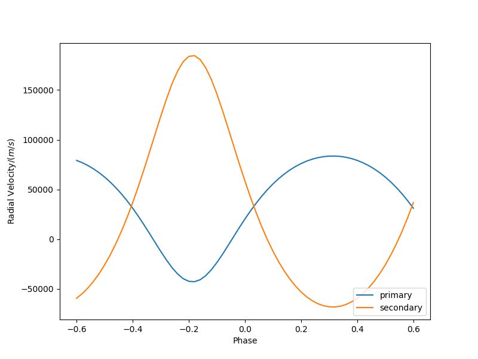
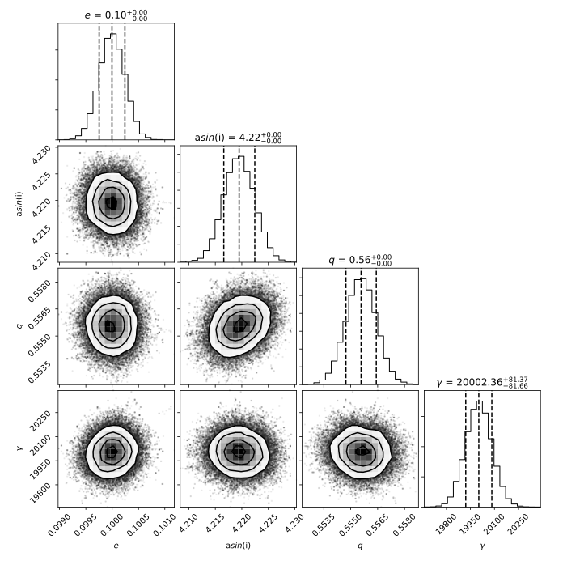

|Travis build|  |GitHub version|  |Licence GPLv2|

.. |Travis build| image:: https://travis-ci.org/mikecokina/elisa.svg?branch=dev
    :target: https://travis-ci.org/mikecokina/elisa

.. |GitHub version| image:: https://img.shields.io/badge/version-0.2.dev0-yellow.svg
   :target: https://github.com/Naereen/StrapDown.js

.. |Licence GPLv2| image:: https://img.shields.io/badge/License-GNU/GPLv2-blue.svg
   :target: https://github.com/Naereen/StrapDown.js

Eclipsing binaries Learning Interactive System
==============================================

ELISa
-----

**ELISa** is crossplatform python package dedicated to light curves modelling of close eclipsing binaries including
surface features. Current capabilities include:

    - ``BinarySystem:`` class for modelling surfaces of detached, semi-detached and over-contact binaries
    - ``Observer:`` class for generating light curves (and in future other observables)
    - ``Spots:`` class for generating stellar spot with given longitude, latitude, radius and temperature factor
    - ``Fitting methods`` provide capability to fit radial velocities curves and light curves via implementaion of
      ``non-linear least squares`` method and it also implements lightcurve fitting via ``Markov Chain Monte Carlo``
      method.

**ELISa** is currently still under development. Following features are in progress:

    - ``SingleSystem:`` class for modelling surfaces of single star light curves with full implementation of spots and
      pulsations
    - ``Pulsations:`` class for modelling low amplitude pulsations based on spherical harmonics

We also plan to implement following features:

    - addition of radial velocity curves to Observer class with ``Rossiter-McLaughlin`` effect
    - ``LC`` and ``RV`` fitting using various methods
    - addition of synthetic spectral line modelling

Requirements
------------

**ELISa** is a python package which requires ``python v3.6+`` and has following dependencies::

    astropy==2.0.2
    cycler==0.10.0
    corner==2.0.1
    emcee==3.0.1
    jsonschema==3.2.0
    matplotlib==2.1.0
    numpy==1.16.2
    pandas==0.24.0
    py==1.4.34
    pyparsing==2.2.0
    pypex==0.1.0
    pytest==3.2.3
    python-dateutil==2.6.1
    pytz==2017.2
    scipy==1.0.0
    six==1.11.0

and potentially also **python-tk** package or equivalent for matplotlib package to display the figures correctly.

:note: although python distribution and package versions are specified precisely, that does not mean that the package will not work with higher versions, only that it was not tested with higher versions of packages. However we highly recommend to stick with python distribution and package versions listed above.

Install
-------

In case of ``ELISa`` the easiest and the safest way to install is to create python virtual
environment and install all requirements into it. Bellow is a simple guide, how to od it. Details of installation differ
in dependence on the selected operating system.

Ubuntu [or similar]
~~~~~~~~~~~~~~~~~~~

First, you have to install Python 3.6 or higher. In latest stable version ``Ubuntu 18.04`` there is already preinstalled
python `3.6.x`. In older versions, you will have to add repository and install it manually. There is several quides
on the internet that will help you with installation, e.g. Python_3.6_

.. _Python_3.6: http://ubuntuhandbook.org/index.php/2017/07/install-python-3-6-1-in-ubuntu-16-04-lts/

Install ``pip3`` python package manager if is not already installed on your system, usually by execution of command::

    apt install -y python3-pip

or you can also use `raw` python script which provide installation via ``python``::

    curl https://bootstrap.pypa.io/get-pip.py | python3.6

Install virtual environment by command::

    pip3 install virtualenv

To create virtual environment, create directory where python virtual environment will be stored,
e.g. ``/<any>/<path>/elisa/venv``
and run following command::

    virtualenv /<any>/<path>/elisa/venv --python=python3.6

After few moments you virtual environment is created and ready for use. In terminal window, activate virtual
environment::

    . /<any>/<path>/elisa/venv/bin/activate

When virtual environment is activated, install ``elisa`` package in `dev` version. Execute following command::

    pip install git+https://github.com/mikecokina/elisa.git@dev

You will probably also need to install::

    apt install -y python3-tk

Windows
~~~~~~~

To install python in windows, download ``python 3.6.x`` installation package from official python web site.
Installation package will create all necessary dependencies except of virtual environment package.
Install virtual environment by execution of following command in command line::

    pip3 install virtualenv

Make sure a proper version of  python and pip is used. When done, create directory where virtual environment will be
stored and run::

    virtualenv /<any>/<path>/elisa --python<path>/<to>/python3.6/python.exe

It is common to specify full path to ``python.exe`` file under Windows, otherwise It might not work.

Now, when virtual environment is prepared, run::

    . /<any>/<path>/elisa/Scripts/activate

And finally install ``ELISa``::

    pip install git+https://github.com/mikecokina/elisa.git@dev

Minimal configuration
---------------------

``ELISa`` require before first run minimal configuration provided by config file. Basically it is necessary to download
atmospheres models, limbdarkening tables and configure path to directories where files will be stored.

Where to find atmospheres and also atmospheres structure is explained in Atmospheres_
as well as limb darkening in Limb-Darkening_.

.. _Atmospheres: https://github.com/mikecokina/elisa/tree/dev/atmosphere
.. _Limb-Darkening: https://github.com/mikecokina/elisa/tree/dev/limbdarkening

Models might be stored on your machine in directory wherever you desire. For purpose of following guide, lets say you
want ot use ``Castelli-Kurucz 2004`` models stored in directory ``/home/user/castelli_kurucz/ck04`` and Van Hamme
limb darkening models in directory ``/home/user/van_hamme_ld/vh93``. You have to create configuration ``ini`` file where
model and directories will be specified. Just assume, name of our configuration file is ``elisa_config.ini`` located in
path ``/home/user/.elisa/``. Then content of your configuration file should be at least like following::

    [support]
    van_hamme_ld_tables = /home/user/van_hamme_ld/vh93
    castelli_kurucz_04_atm_tables = /home/user/castelli_kurucz/ck04
    atlas = ck04

Full content of configuration file with description might be found here, Elisa-Configuration-File_

.. _Elisa-Configuration-File: https://github.com/mikecokina/elisa/blob/dev/src/elisa/conf/elisa_conf_docs.ini

:warning: atmospheric models and limb darkening tables are not in native format as usually provided on web sites. Models have been altered to form required for elisa.

Now, you have to tell ELISa, where to find configuration file. In environment you are using setup environment variable
`ELISA_CONFIG` to full path to config file. In UNIX like operation systems it is doable by following command::

    export ELISA_CONFIG=/home/user/.elisa/elisa_config.ini

There is plenty ways how to setup environment variable which vary on operation system and also on tool (IDE)
that you have in use.

Now you are all setup and ready to code.

Usage
-------
For in depth tutorials, see directory ``elisa/jupyter_tutorials``

Available passbands
-------------------

::

    bolometric
    Generic.Bessell.U
    Generic.Bessell.B
    Generic.Bessell.V
    Generic.Bessell.R
    Generic.Bessell.I
    SLOAN.SDSS.u
    SLOAN.SDSS.g
    SLOAN.SDSS.r
    SLOAN.SDSS.i
    SLOAN.SDSS.z
    Generic.Stromgren.u
    Generic.Stromgren.v
    Generic.Stromgren.b
    Generic.Stromgren.y
    Kepler
    GaiaDR2

Multiprocessing
---------------

To speedup computaion of light curves, paralellization of processes has been implemented. Practically, computation
of light curve points is separated to smaller batches and each batch is evaluated on separated CPU core. Paralelliation
necessarily bring some overhead to process and in some cases might cause even slower behavior of application.
It is important to choose wisely when use it espeially in case of circular synchronous orbits which consist of spot-free
components.

Down below are shown some result of multiprocessor approach for different binary system type.

.. figure:: ./docs/source/_static/readme/detached.circ.sync.svg
  :width: 70%
  :alt: detached.circ.sync.svg
  :align: center

  Paralellization benchmark for ``detached circular synchronous`` star system.

.. figure:: ./docs/source/_static/readme/detached.circ.async.svg
  :width: 70%
  :alt: detached.circ.async.svg
  :align: center

  Paralellization benchmark for ``detached circular asynchronous`` star system.

.. figure:: ./docs/source/_static/readme/detached.ecc.sync.svg
  :width: 70%
  :alt: detached.ecc.sync.svg
  :align: center

  Paralellization benchmark for ``detached eccentric synchronous`` star system.

Binary Stars Radial Curves Fitting
----------------------------------

In current version of `ELISa`, you can use capability to fit curves of radial velocities obtained as velocities
of center of mass from primary and secondary component. An example of synthetic radial vecolity curve is shown below.

This radial velocity curve was obtained on system with following relevant parameters::

    primary mass: 2.0 [Solar mass]
    secondary mass: 1.0 [Solar mass]
    inclination: 90 [degree]
    argument of periastron: 0.0 [degree]
    eccentricity: 0.2 [-]
    period: 4.5 [day]

Each fitting initial input has form like::

    initial = [
        {
            'value': <float>,
            'param': <str>,
            'fixed': <bool>,
            'min': <float>,
            'max': <float>,
            'constraint': <str>
        }, ...
    ]

and require all params from following list if you would like to try absolute parameters fitting:

    * ``p__mass`` - mass of primary component in units of Solar mass
    * ``s__mass`` - mass of secondary component in units of Solar mass
    * ``eccentricity`` - eccentricity of binary system, (0, 1)
    * ``inclination`` - inclination of binary system in `degrees`
    * ``argument_of_periastron`` - argument of periastron in `degrees`
    * ``gamma`` - radial velocity of system center of mass in `m/s`

or otherwise, in community approach, you can use instead of ``p__mass``, ``s__mass`` and ``inclination`` parametres:

    * ``asini`` - product of sinus of inclination and semi major axis in units of Solar radii
    * ``mass_ratio`` - mass ratio, known as `q`

There are already specified global minimal an maximal values for parameters, but user is free to adjust parameters
which might work better for him.

Parameter set to be `fixed` is naturaly not fitted and its value is fixed during procedure.

In this part you can see minimal example of base code providing fitting. Sample radial velocity curve was obtained
by parameters::

        [
            {
                'value': 0.1,
                'param': 'eccentricity',
            },
            {
                'value': 4.219,
                'param': 'asini',
            },
            {
                'value': 0.5555,
                'param': 'mass_ratio',
            },
            {
                'value': 0.0,
                'param': 'argument_of_periastron'
            },
            {
                'value': 20000.0,
                'param': 'gamma'
            }
        ]

.. code:: python

    import numpy as np
    from elisa.analytics.binary.least_squares import central_rv

    def main():
        phases = np.arange(-0.6, 0.62, 0.02)
        rv = {
            'primary': np.array([111221.02018955, 102589.40515112, 92675.34114568, ...]),
            'secondary': np.array([-144197.83633559, -128660.92926642, -110815.61405663, ...])
        }

        rv_initial_parameters = [
            {
                'value': 0.2,
                'param': 'eccentricity',
                'fixed': False,
                'min': 0.0,
                'max': 0.5

            },
            {
                'value': 10.0,  # 4.219470628180749
                'param': 'asini',
                'fixed': False,
                'min': 1.0,
                'max': 20.0

            },
            {
                'value': 1.0,  # 1.0 / 1.8
                'param': 'mass_ratio',
                'fixed': False,
                'min': 0,
                'max': 10
            },
            {
                'value': 0.0,
                'param': 'argument_of_periastron',
                'fixed': True
            },
            {
                'value': 20000.0,
                'param': 'gamma',
                'fixed': True
            }
        ]

        result = central_rv.fit(xs=phases, ys=rv, period=0.6, x0=rv_initial_parameters, yerrs=None)

    if __name__ == '__main__':
        main()

Result of fitting procedure was estimated as

.. code:: python

    [
        {
            "param": "eccentricity",
            "value": 0.09827682337603573,
            "unit": "dimensionless"
        },
        {
            "param": "asini",
            "value": 4.224709745351374,
            "unit": "solRad"
        },
        {
            "param": "mass_ratio",
            "value": 0.5471319947199411,
            "unit": "dimensionless"
        },
        {
            "param": "argument_of_periastron",
            "value": 0.0,
            "unit": "degrees"
        },
        {
            "param": "gamma",
            "value": 20000.0,
            "unit": "m/s"
        },
        {
            "r_squared": 0.9983458226020854
        }
    ]

.. image:: ./docs/source/_static/readme/rv_fit.svg
  :width: 70%
  :alt: rv_fit.svg
  :align: center

Another approach is to use implemented fitting method based on `Markov Chain Monte Carlo`. Read data output requires
more analytics skills, some minimal expirience with MCMC since output is not simple dictionary of values but
it is basically descriptive set of parameters progress during evaluation of method.

Following represents minimalistic base code which should explain how to use mcmc method and how to read outputs.

.. code:: python

    import numpy as np
    from elisa.analytics.binary.mcmc import central_rv

    def main():
        phases = np.arange(-0.6, 0.62, 0.02)
        rv = {'primary': np.array([111221.02018955, 102589.40515112, 92675.34114568,..., -22875.63138097]),
              'secondary': np.array([-144197.83633559, -128660.92926642, -110815.61405663,.., 97176.13649135])}

        rv_initial_parameters = [
            {
                'value': 0.2,
                'param': 'eccentricity',
                'fixed': False,
                'min': 0.0,
                'max': 0.5

            },
            {
                'value': 10.0,  # 4.219470628180749
                'param': 'asini',
                'fixed': False,
                'min': 1.0,
                'max': 20.0

            },
            {
                'value': 1.0,  # 1.0 / 1.8
                'param': 'mass_ratio',
                'fixed': False,
                'min': 0,
                'max': 10
            },
            {
                'value': 0.0,
                'param': 'argument_of_periastron',
                'fixed': True
            },
            {
                'value': 15000.0,
                'param': 'gamma',
                'fixed': False,
                'min': 10000.0,
                'max': 30000.0
            }
        ]

        central_rv.fit(xs=phases, ys=rv, period=0.6, x0=rv_initial_parameters, nwalkers=20,
                       nsteps=10000, nsteps_burn_in=1000, yerrs=None)

        result = central_rv.restore_flat_chain(central_rv.last_fname)
        central_rv.plot.corner(result['flat_chain'], result['labels'], renorm=result['normalization'])

    if __name__ == '__main__':
        main()

Result of code above is corner plot which might looks like this one

Object `central_rv` keep track of last executed mcmc "simulation" so you can work with output. It stores::

    last_sampler: emcee.EnsembleSampler; last instance of `sampler`
    last_normalization: Dict; normalization map used during fitting
    last_fname: str; filename of last stored flatten emcee `sampler` with metadata

There are also such informations stored in "elisa home" in json file, so you are able to parse and work with each
previous run.

:note: just beware, there was no bias added to data in case of mcmc fitting and
       this is a reason why error of params is close to zero

Binary Stars Radial Light Fitting
---------------------------------

Packgae `elisa` currently implements two approaches to be able provide very basic fitting of light curves.
First method is standard approach which use `non-linear least squares` method algorithm and second rule
Markov Chain Monte Carlo (`MCMC`) method.

Following chapter is supposed to give you brief information about capabilities provided by `elisa`.
Lets assume that we have a given light curve like lightcurve below

.. image:: ./docs/source/_static/readme/lc_example.svg
  :width: 70%
  :alt: lc_example.svg
  :align: center

Such light curve came from parameters::

    [
        {
            'value': 2.0,
            'param': 'p__mass'
        },
        {
            'value': 5000.0,
            'param': 'p__t_eff'
        },
        {
            'value': 5.0,
            'param': 'p__surface_potential'
        },
        {
            'value': 1.0,
            'param': 's__mass'
        },
        {
            'value': 7000.0,
            'param': 's__t_eff'
        },
        {
            'value': 5,
            'param': 's__surface_potential'
        },
        {
            'value': 90.0,
            'param': 'inclination'
        }
    ]

with some bias added. Such parameters are equivalent to following::

    [
        {
            'value': 0.5,
            'param': 'mass_ratio'
        },
        {
            'value': 12.625,
            'param': 'semi_major_axis'
        },
        ...
    ]

community used parmaeters, where instead of masses for both
components are used semi major axis and mass ratio. All other parametres are assumed to be adjusted to create
circular synchronous system.

Lets apply some fitting algorithm to demonstrate software capabilities. Fitting modules are stored in module path
``elisa.analytics.binary.least_squares`` and ``elisa.analytics.binary.mcmc``. It is up on the user what methods
choose to use. In both cases, there is prepared instances for fitting, called ``binary_detached`` and ``binary_overcontact``.
Difference is that ``binary_overcontact`` fitting module keeps surface potentiaal of both binary components constrained
to same value.

First, we elaborate algorithms based on `non-linear least squares` method. Binary system which can generate light curve
shown above is with no doubt detached system, so it makes sence to use module ``binary_detached``.

:warning: Non-linear least squares method used in such complex problem as fitting of eclipsing binaries stars
          light curves definitely is, might be insuficient in case of initial parametres which are too far from real
          values and also too broad fitting boundaries.

Here is minimal base code for demonstration of light curve fitting via ``binary_detached`` module.

.. code:: python

    import numpy as np
    from elisa.analytics.binary.least_squares import binary_detached

    init = [
                {
                    'value': 1.0,
                    'param': 'mass_ratio',
                    'fixed': False,
                    'min': 0.1,
                    'max': 3.0
                },
                {
                    'value': 10.0,
                    'param': 'semi_major_axis',
                    'fixed': False,
                    'min': 8.0,
                    'max': 15.0
                },
                {
                    'value': 6000.0,
                    'param': 'p__t_eff',
                    'fixed': False,
                    'min': 4000.0,
                    'max': 7000.0
                },
                {
                    'value': 4.0,
                    'param': 'p__surface_potential',
                    'fixed': False,
                    'min': 4.0,
                    'max': 10.0
                },
                {
                    'value': 8000.0,
                    'param': 's__t_eff',
                    'fixed': False,
                    'min': 6000.0,
                    'max': 10000.0
                },
                {
                    'value': 6.0,
                    'param': 's__surface_potential',
                    'fixed': False,
                    'min': 4.0,
                    'max': 10.0
                },
                {
                    'value': 90.0,
                    'param': 'inclination',
                    'fixed': True
                }
            ]

    def main():
        phases = np.arange(-0.6, 0.62, 0.02)
        lc = {
            'Generic.Bessell.V': np.array([111221.02018955, 102589.40515112, 92675.34114568, ...]),
            'Generic.Bessell.B': np.array([-144197.83633559, -128660.92926642, -110815.61405663, ...])
        }
        result = binary_detached.fit(xs=phases, ys=lc, period=3.0, discretization=5, x0=dinit, xtol=1e-5, yerrs=None)

    if __name__ == "__main__":
        main()

Solution obtained from such approach is::

    [
        {
            "param": "mass_ratio",
            "value": 0.7258200560190059,
            "unit": "dimensionless"
        },
        {
            "param": "semi_major_axis",
            "value": 9.99079425680755,
            "unit": "solRad"
        },
        {
            "param": "p__t_eff",
            "value": 5020.857511549073,
            "unit": "K"
        },
        {
            "param": "p__surface_potential",
            "value": 5.207136874939402,
            "unit": "dimensionless"
        },
        {
            "param": "s__t_eff",
            "value": 7031.648838850117,
            "unit": "K"
        },
        {
            "param": "s__surface_potential",
            "value": 6.639593976078232,
            "unit": "dimensionless"
        },
        {
            "param": "inclination",
            "value": 90.0,
            "unit": "degrees"
        },
        {
            "r_squared": 0.9988791463851956
        }
    ]

As you can see and as is commonly known, corelaction of parameters is so strong that slightly different parameters
can lead to fit which is good enough to describe observed data.

Here you can see visual output

.. image:: ./docs/source/_static/readme/lc_fit.svg
  :width: 70%
  :alt: lc_fit.svg
  :align: center

:note: In mentioned approach we used community parmeters :math:`q` and :math:`a` instead of :math:`M_1` and :math:`M_2`, but
       if you are somehow aware of information when is better to use masses, it is of course fully implemented and compatible.

Lets assume that we also posses radial velocities and we were able to obtain :math:`q` and :math:`asini`. Since we observed
binary system via several optical filters then we can get B-V index and estimate effective temperature :math:`T_^{eff}_1`
about photomeric phase, :math:`\Phi` = 0.75. Using Ballestero's formula we get :math:`T_^{eff}_1` ~ 6000K.
$`\Phi` = 0.75$
