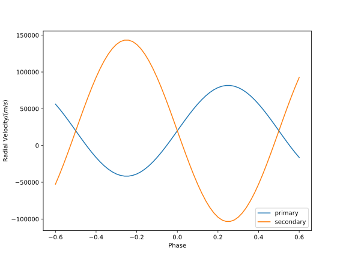
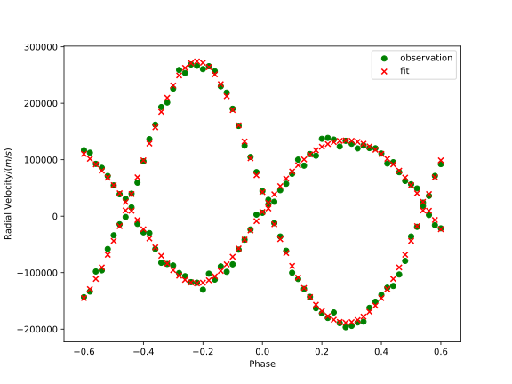
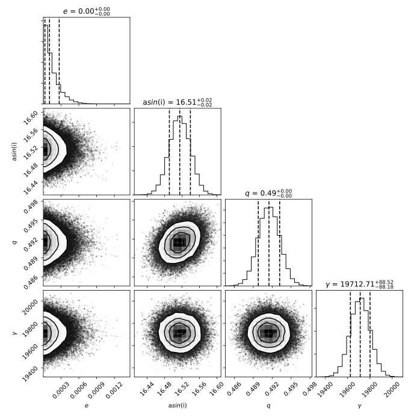
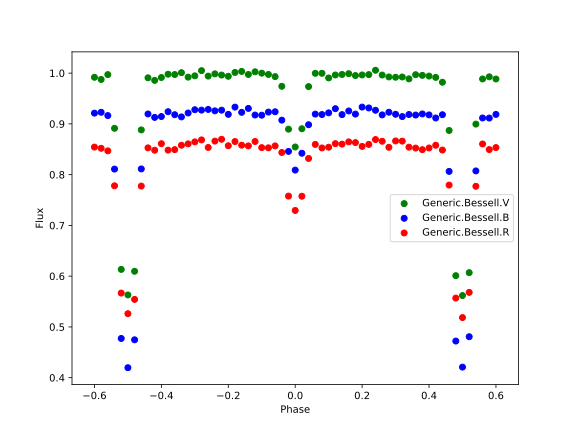
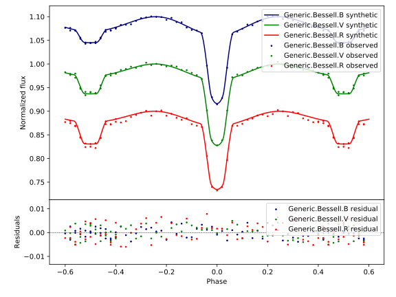
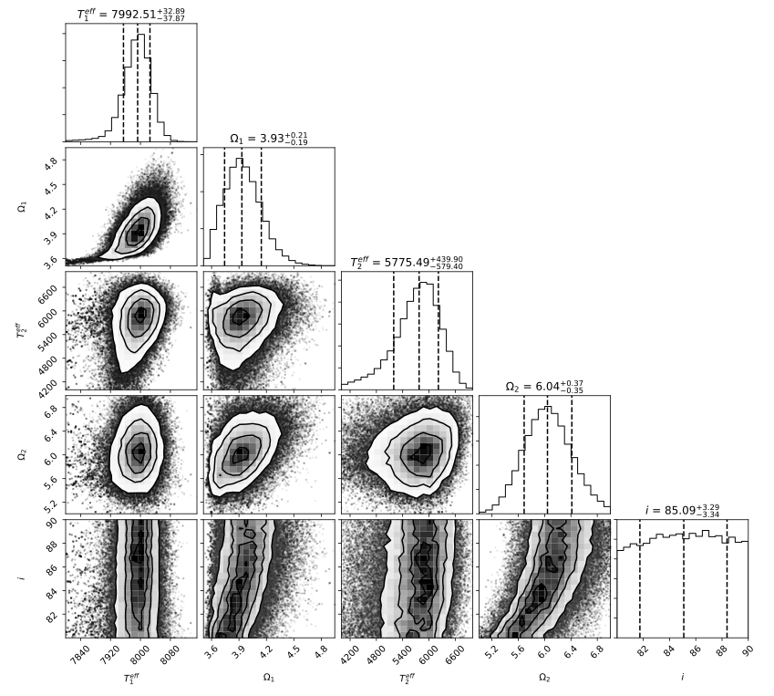

|Travis build|  |GitHub version|  |Licence GPLv2| |Python version| |OS|

.. |Travis build| image:: https://travis-ci.org/mikecokina/elisa.svg?branch=dev
    :target: https://travis-ci.org/mikecokina/elisa

.. |GitHub version| image:: https://img.shields.io/badge/version-0.4-yellow.svg
   :target: https://github.com/Naereen/StrapDown.js

.. |Python version| image:: https://img.shields.io/badge/python-3.6|3.7|3.8-orange.svg
   :target: https://github.com/Naereen/StrapDown.js

.. |Licence GPLv2| image:: https://img.shields.io/badge/license-GNU/GPLv2-blue.svg
   :target: https://github.com/Naereen/StrapDown.js

.. |OS| image:: https://img.shields.io/badge/os-Linux|Windows-magenta.svg
   :target: https://github.com/Naereen/StrapDown.js

.. _example_scripts: https://github.com/mikecokina/elisa/tree/master/scripts/analytics

Eclipsing binaries Learning Interactive System
==============================================

ELISa
-----

**ELISa** is crossplatform python package dedicated to light curves modelling of close eclipsing binaries including
surface features such as spots and pulsation (soon). Current capabilities include:

    - ``BinarySystem:`` class for modelling surfaces of detached, semi-detached and over-contact binaries
    - ``Observer:`` class for generating light curves (and in future other observables)
    - ``Spots:`` class for generating stellar spot with given longitude, latitude, radius and temperature factor
    - ``Fitting methods`` provide capabilities to fit radial velocities curves and light curves via implementaion of
      ``non-linear least squares`` method and also via ``Markov Chain Monte Carlo`` method.

**ELISa** is currently still under development. Following features are in progress:

    - ``SingleSystem:`` class for modelling surfaces of single star light curves with full implementation of spots and
      pulsations
    - ``Pulsations:`` class for modelling low amplitude pulsations based on spherical harmonics solution

We also plan to implement following features:

    - addition of radial velocity curves to Observer class with ``Rossiter-McLaughlin`` effect
    - some extended ``LC`` and ``RV`` fitting using various additional methods and features like classification via ``neural-networks``
    - addition of synthetic spectral line modelling

Requirements
------------

**ELISa** is a python package which requires ``python v3.6+`` and has following dependencies::

    astropy>=4.0.1.post1
    corner>=2.0.1,<=2.1.0
    emcee==3.0.1
    jsonschema>=3.2.0
    matplotlib==3.3.2
    numpy>=1.16.2,<=1.19.2
    pandas>=0.24.0,<=1.1.2
    pypex==0.1.0
    pytest==3.2.3
    python-dateutil>=2.6.1,<=2.8.1
    scipy>=1.0.0,<=1.5.2
    tqdm==4.43.0
    parameterized>=0.7.4

and potentially also **python-tk** package or equivalent for matplotlib package to display the figures correctly.

:note: although python distribution and package versions are specified precisely, that does not mean that the package will not work with higher versions, only that it was not tested with higher versions of packages. However we highly recommend to stick with python distribution and package versions listed above.

Install
-------

In case of ``ELISa`` the easiest and the safest way to install is to create python virtual
environment and install all requirements into it. Bellow is a simple guide, how to od it. Details of installation differ
in dependence on the selected operating system.

Ubuntu [or similar]
~~~~~~~~~~~~~~~~~~~

First, you have to install Python 3.6 or higher. In latest stable version ``Ubuntu 18.04`` there is already preinstalled
python `3.6.x`. In older versions, you will have to add repository and install it manually. There is several quides
on the internet that will help you with installation, e.g. Python_3.6_

.. _Python_3.6: http://ubuntuhandbook.org/index.php/2017/07/install-python-3-6-1-in-ubuntu-16-04-lts/

Install ``pip3`` python package manager if is not already installed on your system, usually by execution of command::

    apt install -y python3-pip

or you can also use `raw` python script which provide installation via ``python``::

    curl https://bootstrap.pypa.io/get-pip.py | python3.6

Install virtual environment by command::

    pip3 install virtualenv

To create virtual environment, create directory where python virtual environment will be stored,
e.g. ``/<any>/<path>/elisa/venv``
and run following command::

    virtualenv /<any>/<path>/elisa/venv --python=python3.6

After few moments you virtual environment is created and ready for use. In terminal window, activate virtual
environment::

    . /<any>/<path>/elisa/venv/bin/activate

When virtual environment is activated, install ``elisa`` package in `dev` version. Execute following command::

    pip install git+https://github.com/mikecokina/elisa.git@dev

You will probably also need to install::

    apt install -y python3-tk

If you would like to have a look at the jupyter notebooks covering the basic usage of this package, you should install
jupyterlab inside the previously created virtual environment::

    pip3 install jupyterlab

followed by installation of ipython kernel::

    python3 -m pip install ipykernel

Now you should be able to launch jupyter notebooks and run the tutorials stored in <elisa_dir>/jupyter_tutorials/.

Windows
~~~~~~~

To install python in windows, download ``python 3.6.x`` installation package from official python web site.
Installation package will create all necessary dependencies except of virtual environment package.
Install virtual environment by execution of following command in command line::

    pip3 install virtualenv

Make sure a proper version of  python and pip is used. When done, create directory where virtual environment will be
stored and run::

    virtualenv /<any>/<path>/elisa --python<path>/<to>/python3.6/python.exe

It is common to specify full path to ``python.exe`` file under Windows, otherwise It might not work.

Now, when virtual environment is prepared, run::

    . /<any>/<path>/elisa/Scripts/activate

And finally install ``ELISa``::

    pip install elisa

How to build API docs
=====================

Use virtual environment created in previous steps and add following dependencies::

    Sphinx==2.2.0
    sphinx-rtd-theme==0.4.3

.. _docs: https://github.com/mikecokina/elisa/tree/master/docs

Change directory to cloned docs_ and use following command::

    sphinx-build -W -b html -c .\source -d .\build\doctrees .\source\ .\build\

Minimal configuration
---------------------

``ELISa`` requires minimal configuration before the first run provided by the config file. Initially, it is necessary to
download Atmospheres_ models and Limb-Darkening_ tables.

.. _Atmospheres: https://github.com/mikecokina/elisa/tree/dev/atmosphere
.. _Limb-Darkening: https://github.com/mikecokina/elisa/tree/dev/limbdarkening

Default tables location
~~~~~~~~~~~~~~~~~~~~~~~

By default, the Elisa will search for atmosphere and limb darkening tables in:

 - atmospheres: $HOME/.elisa/atmosphere/
 - limb darkening: $HOME/.elisa/limb_darkening/

therefore, atmosphere and limb darkening tables stored at those locations will be used by elisa by default.

Custom tables location
~~~~~~~~~~~~~~~~~~~~~~~

Models can be stored on your machine in directory of your choosing as well. Lets say you want ot use ``Castelli-Kurucz 2004``
models stored in directory ``/home/user/castelli_kurucz/ck04`` and limb darkening models in directory
``/home/user/ld/``. You have to create configuration ``ini`` file where
model and directories will be specified. Now assume that name of our configuration file is ``elisa_config.ini`` located
in path ``/home/user/.elisa/``. Then content of your configuration file should at least look like this following
example::

    [support]
    ld_tables = /home/user/ld
    castelli_kurucz_04_atm_tables = /home/user/castelli_kurucz/ck04
    atlas = ck04

This configuration file is used for adjusting Full content of configuration file with description might be found here,
Elisa-Configuration-File_

.. _Elisa-Configuration-File: https://github.com/mikecokina/elisa/blob/master/src/elisa/conf/elisa_conf_docs.ini

:warning: atmospheric models and limb darkening tables for this package are stored in industry standard ''.csv'' files.
          Therefore, their native format as usually provided on web sites is not suitable for Elisa and require
          conversion to standard format. Models have been altered to form required for Elisa.

Now, you have to tell ELISa, where to find configuration file. In environment you are using setup environment variable
`ELISA_CONFIG` to full path to config file. In UNIX like operation systems it is done by following command::

    export ELISA_CONFIG=/home/user/.elisa/elisa_config.ini

There is plenty ways how to setup environment variable which vary on operation system and also on tool (IDE)
that you have in use. On linux, as an example, you can copy the previous command to #HOME/.bashrc (depends on terminal
type). Optionally, you can use ``config.ini`` file located in ``ELISa_folder/src/elisa/conf/`` without
any need for setting an enviromental variable.

Now you are all setup and ready to code.

Usage
-------
For in depth tutorials, see directory ``elisa/jupyter_tutorials``

Available passbands
-------------------

::

    bolometric
    Generic.Bessell.U
    Generic.Bessell.B
    Generic.Bessell.V
    Generic.Bessell.R
    Generic.Bessell.I
    SLOAN.SDSS.u
    SLOAN.SDSS.g
    SLOAN.SDSS.r
    SLOAN.SDSS.i
    SLOAN.SDSS.z
    Generic.Stromgren.u
    Generic.Stromgren.v
    Generic.Stromgren.b
    Generic.Stromgren.y
    Kepler
    GaiaDR2

Multiprocessing
---------------

To speedup computation of light curves, paralellization of computations has been implemented. Computation
of light curve points is separated to smaller batches and each batch is evaluated on separated CPU core. Paralellization
necessarily brings some overhead to process and in some cases might cause even slower behavior of application.
It is important to choose wisely when use it espeically in case of circular synchronous orbits which consist of
spot-free components where multiprocessing is usually not as effective.

Down below are shown some result of multiprocessor approach for different binary system types. Absolute time necessary
for calculation of the light curve is highly dependent on the type of the system and hardaware. Therefore we have
normalized the time axis according to maximum value in our datasets.

.. figure:: ./docs/source/_static/readme/detached.circ.sync.svg
  :width: 70%
  :alt: detached.circ.sync.svg
  :align: center

  Paralellization benchmark for ``detached circular synchronous`` star system.

.. figure:: ./docs/source/_static/readme/detached.circ.async.svg
  :width: 70%
  :alt: detached.circ.async.svg
  :align: center

  Paralellization benchmark for ``detached circular asynchronous`` star system.

.. figure:: ./docs/source/_static/readme/detached.ecc.sync.svg
  :width: 70%
  :alt: detached.ecc.sync.svg
  :align: center

  Paralellization benchmark for ``eccentric synchronous`` star system.

:note: outliers in charts are caused by curve symetrization process

Binary Stars Radial Curves Fitting
----------------------------------

`ELISa` is capable to fit radial velocity curves to observed radial velocities.
In current version of `ELISa`, the radial velocity curves are calculated from radial velocities of centre of mass of
primary and secondary component. An example of synthetic radial velocity curve is shown below.

This radial velocity curve was obtained on system with following relevant parameters::

    primary mass: 2.0 [Solar mass]
    secondary mass: 1.0 [Solar mass]
    inclination: 85 [degree]
    argument of periastron: 0.0 [degree]
    eccentricity: 0.0 [-]
    period: 4.5 [day]
    gamma: 20000.0 [m/s]

Each fitted parameter has an input form as follows::

    <param>: {
        'value': <float>,
        'fixed': <bool>,
        'min': <float>,
        'max': <float>,
        'constraint': <str> // mutualy inclusive with fixed: True
    }

and require all params from the following list if you would like to try absolute parameters fitting:

    * ``mass`` - mass of primary/secondary component (in Solar masses)
    * ``eccentricity`` - eccentricity of binary system, (0, 1)
    * ``inclination`` - inclination of binary system in `degrees`
    * ``argument_of_periastron`` - argument of periastron in `degrees`
    * ``gamma`` - radial velocity of system center of mass in `m/s`
    * ``period`` - period of binary system (in days), usually fixed parameters
    * ``primary_minimum_time`` - numeric time of primary minimum (ny time units); used when exact period is unknown and fitting is required

or otherwise, in "community approach", you can use instead of ``mass`` and ``inclination`` parameters:

    * ``asini`` - in Solar radii
    * ``mass_ratio`` - mass ratio (M_2/M_1), also known as `q`

There are already specified global minimal and maximal values for parameters, but user is highly encouraged to adjust
parameter boundaries which might work better for the particular case.

Parameter set to be `fixed` will not be fitted and its value will stay fixed during the fitting procedure. User can
also setup `constraint` for any parameter, e.g.::

    'semi_major_axis': {
        'value': 16.515,
        'constraint': '16.515 / sin(radians(system@inclination))'
    },

It is allowed to put bounds (constraints) only on parameter using other free parameters, otherwise the parameter should stay fixed.
For example, it makes no sense to set bound like this::

   {
        ...,
        "primary": {
            "t_eff": {
                'value': 5000.0,
                'fixed': True
            },
            ...
        },
        "secondary": {
            "t_eff": {
                'value': 10000.0,
                'constraint': '{primary@t_eff * 0.5}'
            },
            ...
        }
    }

because you're already aware of value ``primary@t_eff``.

Elisa currently implements two fitting approaches, first is based on non-linear least squares method
and second is based on `Markov Chain Monte Carlo` (MCMC) methd.

Reading data output of MCMC requires an experience with MCMC since output is not simple dictionary but
a descriptive set of parameters progress during evaluation of method.

Demonstrated result of fitting of radial velocities might seen like following

An example scripts can be found in example_scripts_

Binary Stars Radial Curves Fitting - No Ephemeris
-------------------------------------------------

In case we do not have enough information / measurements and we are not able determine ephemeris with
desired accuracy, analytics modules of elisa are capable to handle such situation and gives you tools to fit
period and primary minimum time as unknown parameters. In such case, `xs` values has to be supplied in form::

    {
        "primary": [jd0, jd1, ..., jdn],
        "secondary": [jd0, jd1, ..., jdn],
    }

Based on primiary minimum time and period adjusted in fitting proces, JD times are transformed to phases within process
itself.

:warning: make sure you have reasonable boundaries set for `primary_minimum_time` and `period`

Corner plot of `mcmc` result for such approach is in figure bellow

.. image:: ./docs/source/_static/readme/ mcmc_rv_corner_noperiod.svg
  :width: 95%
  :alt: mcmc_rv_corner_noperiod.svg
  :align: center

An example scripts can be found in example_scripts_

Binary Stars Light Curves Fitting
---------------------------------

Package `elisa` currently implements two approaches that provides very basic capability to fit light curves to
observed photometric data. First method is standard approach which use `non-linear least squares` method algorithm and
second approach uses Markov Chain Monte Carlo (`MCMC`) method.

Following chapter is supposed to give you brief information about capabilities provided by `elisa`.
Lets assume that we have a given light curve like shown below generated on parameters::

    {
        "system": {
            'mass_ratio': 0.5,
            'semi_major_axis': 16.54321389,
            'inclination': 85.0,
            'eccentricity': 0.0,
            'period': 4.5
        },
        "primary": {
            't_eff': 8000.0,
            'surface_potential': 4.0,
            'beta': 0.32,
            'albedo': 0.6,
        },
        "secondary": {
            't_eff': 8000.0,
            'surface_potential': 4.0,
            'beta': 0.32,
            'albedo': 0.6,
        }
    }

It is up to the user what methods choose to use (mcmc or least_squares). In both cases, fitting requires provide
morphology estimation. In case of over-contact morphology, fitting module keeps surface potential of both binary
components constrained to the same value.

:warning: Non-linear least squares method used in such complex problem as fitting light
          curves of eclipsing binaries, might be insuficient in case of initial parametres being
          too far from real values and also too broad fitting boundaries.

First, you should solve radial velocities if available and fix parametres in light curve fitting. Since we were able
to obtain some basic information about our system, we should fix or efficiently truncate boundaries
for following parameters::

    "system": {
        ...,
        "asini": 16.515,
        "mass_ratio": "0.5",
        "eccentricity": "0.0",
        "argument_of_periastron": 0.0
    }

.. _Ballesteros: https://arxiv.org/pdf/1201.1809.pdf

We can also estimate surface temperature of primary component via formula implemented in `elisa` package.

.. code:: python

    from elisa.analytics import bvi
    b_v = bvi.pogsons_formula(lc['Generic.Bessell.B'][55], lc['Generic.Bessell.V'][55])
    bvi.elisa_bv_temperature(b_v)

This approach give us value ~ 8307K.

:note: index `55` is used because we know that such index will give as flux on photometric phase :math:`\Phi=0.5`,
       where we eliminte impact of secondary component to result of primary component temperature.

:note: we recommend you to set boundaries for temperature obtained from `bvi` module at least in range +/-500K.

:warning: Use this feature only in case when you are sure about curves offsets to each other.

Visualization of fit is

``Elisa`` also provides lightcurve fitting method based on `Markov Chain Monte Carlo`. Read data output requires
the same level of knowledge as in case of radial velocities fitting.

Corner plot of `mcmc` result for such approach is in figure bellow

All example scripts can be found in example_scripts_
